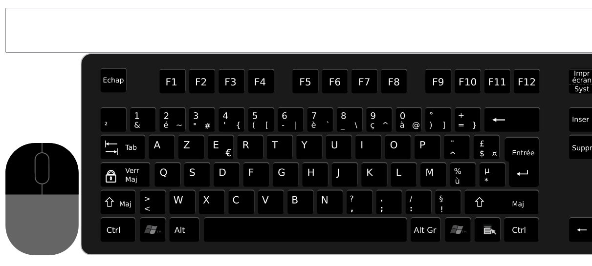

# Affichage touches clavier azerty

Clavier à but pédagogique pour montrer à des débutants les positions des touches, les combinaisons.

Peut aussi servir pour faire des copies d'écrans ou des screencast de saisies clavier.

# Démo 

https://adn56.net/jckeyb/

# Licence

Licence [Creative Commons Attribution](https://en.wikipedia.org/wiki/fr:Creative_Commons) – [Partage dans les Mêmes Conditions 3.0 (non transposée)](https://creativecommons.org/licenses/by-sa/3.0/deed.fr). 

Fichier svg du clavier forké depuis cette ressource wikipedia : https://fr.wikipedia.org/wiki/Fichier:Azerty_fr.svg

